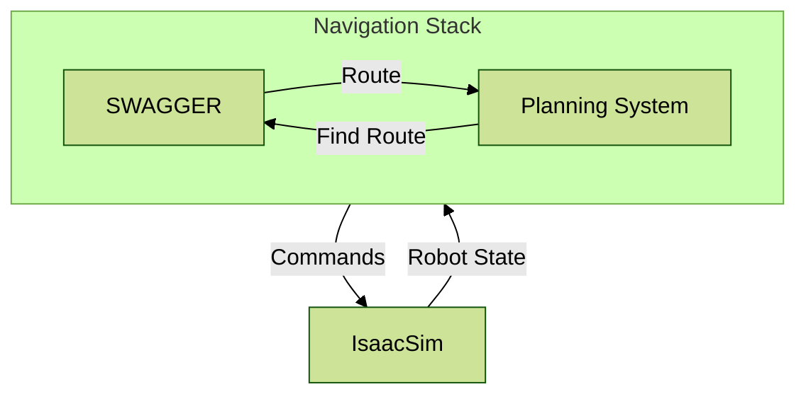

# Integration of SWAGGER for navigation using IsaacSim

We provide two example integrations for using SWAGGER for navigation. These are not meant for fully-fledged production use, but as example of how to integrate SWAGGER in larger robot systems, whether classical or end-to-end based.

- [With COMPASS](./compass/README.md): End-to-end navigation using a neural model that takes images in and actions out, with SWAGGER used to generate route hints for the model.
- [With navigation2](./nav2/README.md): Classical navigation using the ROS2 navigation2 stack, where SWAGGER is used as a global planner plugin to generate global paths.

## Integration dependencies

These integrations are built as ROS2 applications and tested with [ROS2 Humble](https://docs.ros.org/en/humble/index.html).

These integrations have been tested with [Isaac Sim 5.0](https://docs.isaacsim.omniverse.nvidia.com/latest/index.html) as the underlying simulator. Refer to [the Workstation Installation section](https://docs.isaacsim.omniverse.nvidia.com/latest/installation/install_workstation.html#workstation-installation) of the documentation for installing Isaac Sim on your machine.

In the scenes we use, we use the [Nova Carter](https://docs.isaacsim.omniverse.nvidia.com/latest/assets/usd_assets_robots.html#id3) robot.
We use a simple warehouse scene for all these integrations.



### Enabling 2D lidars

For navigation using localization with AMCL, we need to first enable 2D lidars in the scene using these steps

1. Launch Isaac Sim with the Isaac Sim selector. Select `isaacsim.ros2.bridge` for "ROS Bridge Extension" and **humble** for "Use Internal ROS2 Libraries".
2. Open scene using these sequence: `Window` > `Examples` > `Robotics Examples`. Then on the bottom left select the `Robotics Examples` tab and navigate to `ROS2` > `Navigation`, then click on `Nova Carter` and `Load Sample Scene`.
3. Enable 2d lidar by clicking on the `enabled` radio button for the **render** products for both `front_2d_lidar_render_product` and `back_2d_lidar_render_product` 2D lidars. See the image below for reference. See the image below for reference.

    

4. Verify by clicking "Play" and checking that 2d lidar topics are available and have data.

   ```
   # List all topics
   source /opt/ros/humble/setup.bash
   ros2 topic list
   # Look out for the following in the list:
   # - /back_2d_lidar/scan
   # - /front_2d_lidar/scan
   # Make sure the have data
   ros2 topic echo /back_2d_lidar/scan
   ros2 topic echo /front_2d_lidar/scan
   ```

5. Stop the simulation before launching the integration examples.


### Localize the Robot and Start Navigation

The integration example launches [RViz](https://docs.ros.org/en/humble/Tutorials/Intermediate/RViz/RViz-User-Guide/RViz-User-Guide.html) for visualization. Before navigation starts, you need to localize the robot. Choose one of the two methods below:

1. Use the **2D Pose Estimate** tool on RViz to set the initial position of the robot. Confirm that the localization is good by visually
checking the lidar scans visualization align with the object boundaries.

2. Use the ROS2 command line interface. In a new terminal, run the following command:
```bash
source /opt/ros/humble/setup.bash
# This sets the robot's initial pose to x=-6.0, y=-1.0, yaw=pi, the pose the robot when the scene starts playing.
ros2 topic pub -1 /initialpose geometry_msgs/PoseWithCovarianceStamped '{ header: {frame_id: "map"}, pose: { pose: {position: {x: -6.0, y: -1.0, z: 0.0}, orientation: {w: 0, z: 1}}, } }'
```

Confirm that the localization is good by visually checking the lidar scans visualization align with the object boundaries.

Now the robot can start navigating. Use the **2D Goal Pose** tool on RViz to issue goals to the navigation stack.
