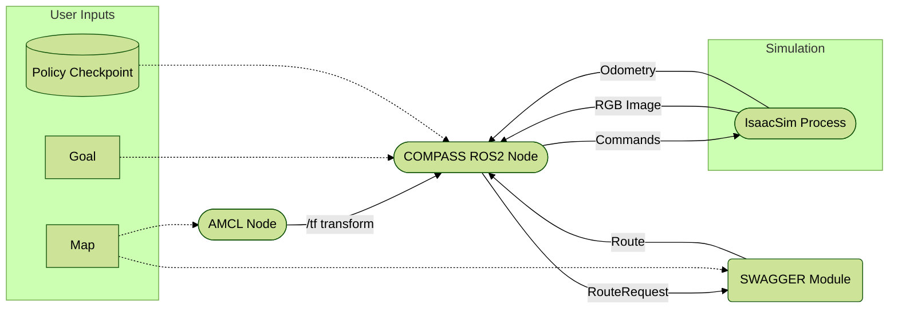

# Integration with [COMPASS](https://nvlabs.github.io/COMPASS/)

COMPASS is an end-to-end AI-based workflow that enable pixels to action for robot mobility and navigation. It includes synthetic datasets, pre-trained model checkpoints, training and finetuning workflows, and deployment. COMPASS can enable local navigation and obstacle avoidance and works across robot embodiments such as AMRs, humanoids, forklift, etc.
Additional details of the compass model are available on the [website](https://nvlabs.github.io/COMPASS/).

Inputs to COMPASS are monocular RGB image, odometry (speed) and route hint. In each inference step, it generates controller commands in form of linear and angular velocities. This integration show how to use SWAGGER to generate the route hint.
Because routing requires a map, and subsequently, localization, we use pieces of ROS2 navigation2 stack for localization, and then generate routes using SWAGGER's `find_route` API, based on robot position and set target goal.



## Usage

1. Clone this repo into a ros2 workspace's source directory, e.g. `~/ros2_ws/src`

   ```bash
   git clone git@github.com:nvidia-isaac/SWAGGER.git
   ```

2. Deactivate from your virtual environment if you are in one, because ROS2 uses the system level Python interpreter.


3. Ensure your pip version is at least 23.0.0 and setuptools at least 70.0.0 but less than 80.0.0. If not,

    ```bash
    pip install --upgrade pip setuptools==79.0.0 packaging
    ```

4. Install the SWAGGER python library

   ```bash
   pip install -e SWAGGER  # or adjust path accordingly
   ```

5. Install other python dependencies

    ```bash
    pip install onnxruntime_gpu torch
    ```

6. Compile the ROS2 packages with colcon, from the workspace root, i.e. `~/ros2_ws` for the example above.

    ```bash
    cd ..
    source /opt/ros/humble/setup.bash
    colcon build --symlink-install --packages-up-to compass_swagger_navigator
    source install/setup.bash # or customize to your shell, e.g. zsh
    ```

7. Download the COMPASS model from Huggingface [https://huggingface.co/nvidia/COMPASS/tree/main](https://huggingface.co/nvidia/COMPASS/tree/main), selecting ONNX or jit as necessary, and put it in some accessible location.

8. Launch IsaacSim and open the scene as explained in [this section](../README.md). Do not hit **Play** yet.

9.  Run the navigator app

    ```bash
    ros2 launch compass_swagger_navigator compass_swagger_navigation.launch.py \
        compass_policy_path:=ABSOLUTE_PATH_TO_POLICY_FILE \  # Downloaded from previous steps
        params_file:=src/waypoint_graph_generator/integration/compass/compass_swagger_navigator/params/params.yaml
    ```

10. Now hit **Play** in IsaacSim. This will initiate publishing of needed sensors and transform topics.
11. Follow the steps in [Localize the Robot and Start Navigation](../README.md#localize-the-robot-and-start-navigation) to start navigation.
